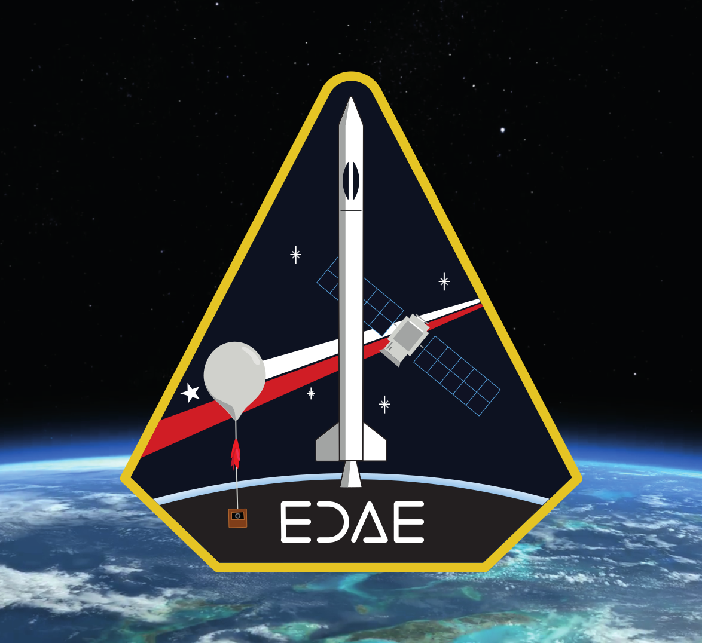

# Nexo EDAE

</img>

Repositorio central para organizar el desarrollo del cohete modelo v1 de EDAE UC.

Aquí podrás encontrar el progreso en el proyecto (véase "Projects" o "Proyectos"), una documentación interna (véase "Wiki"), y un rastreador de problemas y discusiones (Issues). Este repositorio es público y leible por cualquier persona. No se aceptan contribuciones por el momento.
